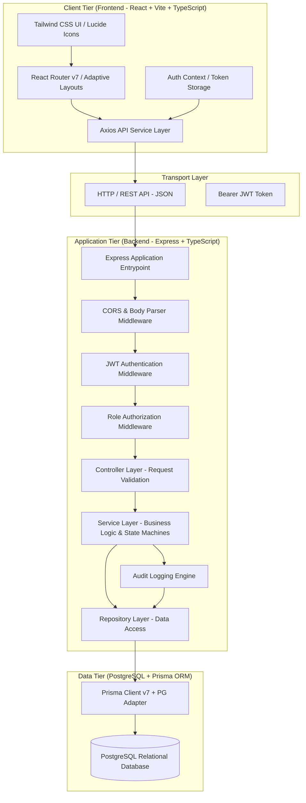
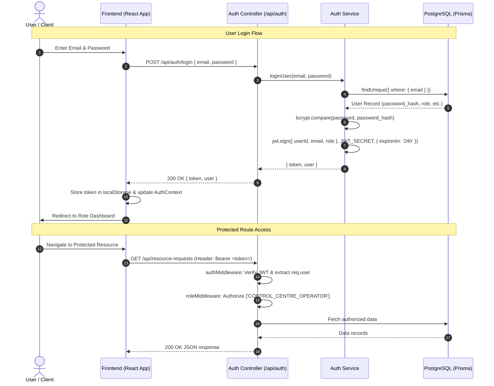
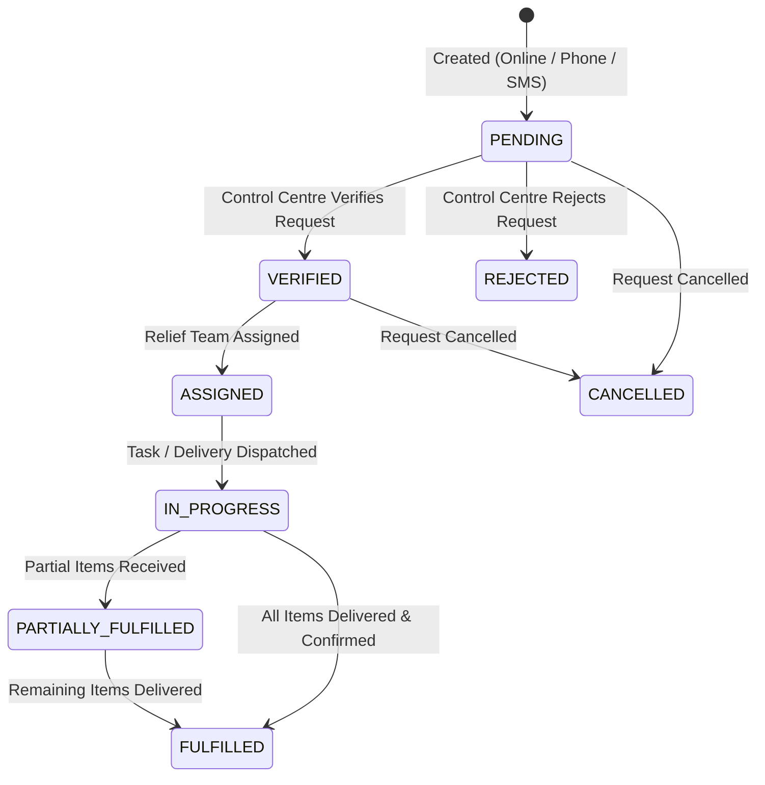
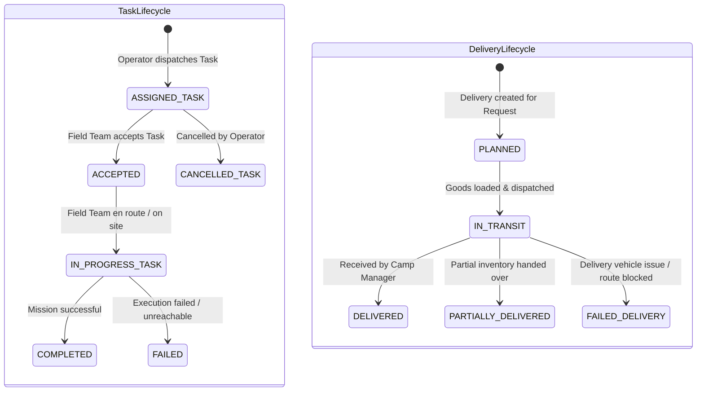

# System Architecture & Technical Design

This document details the architectural design, layered structure, data flows, and security models of the **Disaster Relief Management System (DRMS)** (branded as *CrisisRelief / Disaster Response Grid*).

---

## 1. High-Level Architecture Overview

DRMS follows a decoupled, client-server architecture built on modern web standards with strict separation of concerns, end-to-end type safety, and role-based access control.



---

## 2. Layered Architecture Breakdown

### 2.1. Frontend Architecture (`frontend/src`)

The frontend is a single-page application (SPA) built with React 19, TypeScript, Vite, and Tailwind CSS.

- **Component Hierarchy & Layouts**:
  - `PublicLayout`: Encapsulates public navigation, branding, and crisis alert ribbons for unauthenticated users and citizens.
  - `DashboardLayout`: Provides role-aware navigation sidebars, session status, user profile dropdowns, and active crisis notifications.
  - `AdaptiveLayout`: Dynamically switches between public and dashboard navigation based on active authentication state.
- **Route Guards**:
  - `ProtectedRoute`: Verifies the presence of a valid JWT session in client storage; redirects unauthenticated visitors to `/login`.
  - `RoleRoute`: Validates user role claims against permitted role whitelists (`CITIZEN`, `RELIEF_CAMP_MANAGER`, `CONTROL_CENTRE_OPERATOR`, `DMA_SUPERVISOR`, `RELIEF_TEAM`).
- **Service Abstraction Layer (`frontend/src/services`)**:
  - Standardized Axios instance (`api.ts`) configured with automatic request interceptors that inject `Authorization: Bearer <token>` and response interceptors that clear stale sessions on `401 Unauthorized`.
  - Dedicated service modules for each functional domain (`camp.service.ts`, `resourceRequest.service.ts`, `team.service.ts`, `task.service.ts`, `delivery.service.ts`, `inventory.service.ts`, etc.).

---

### 2.2. Backend Architecture (`backend/`)

The backend is structured using an enterprise **Controller-Service-Repository** pattern in TypeScript:

```
backend/
├── config/             # Prisma client instance and database connection configuration
├── controllers/        # HTTP handlers: request parsing, parameter extraction, response formatting
├── middlewares/        # Security, JWT verification, and role-based authorization guards
├── repositories/       # Prisma query abstraction and database persistence operations
├── routes/             # Express route declarations with endpoint-level middleware binding
├── services/           # Domain business logic, state transitions, validation, and audit tracking
├── prisma/             # Relational data modeling, migrations, and PostgreSQL schema definition
├── app.ts              # Express application assembly and route mounting
└── server.ts           # HTTP server initialization and environment bootstrapper
```

- **Controller Layer (`controllers/`)**:
  - Validates HTTP input parameters, checks payload presence, extracts authenticated user context (`req.user`), and delegates execution to service handlers.
- **Service Layer (`services/`)**:
  - Houses core business rules, entity validations, workflow state machines, duplicate detection algorithms, and automatic audit log generation.
- **Repository Layer (`repositories/`)**:
  - Interacts directly with Prisma Client to execute relational queries, transactions, aggregations, and eager-loading of foreign relations.
- **Middleware Layer (`middlewares/`)**:
  - `authMiddleware.ts`: Decodes and verifies incoming Bearer JWT tokens, ensuring valid session state before route execution.
  - `roleMiddleware.ts`: Verifies that the authenticated user's role matches the required role permissions for the specific endpoint.

---

## 3. Authentication & Authorization Flow



---

## 4. Core Subsystems & Workflows

### 4.1. Dual-Channel Resource Request Ingestion

DRMS supports two distinct channels for raising resource requests:

1. **Online Channel (Camp Manager)**:
   - Raised directly via `POST /api/resource-requests`.
   - Requires `RELIEF_CAMP_MANAGER` role.
   - Automatically bound to the manager's assigned camp ID (`managedCampId`).
   - Channel is strictly recorded as `ONLINE`.
2. **On-Behalf Phone/SMS Channel (Control Centre Operator)**:
   - Raised via `POST /api/resource-requests/on-behalf`.
   - Designed for offline relief camps communicating via emergency telephone or SMS radio.
   - Requires `CONTROL_CENTRE_OPERATOR` role.
   - Operator selects target camp and specifies channel (`PHONE` or `SMS`).
   - Automatically tracks the operator as the digitizer (`createdById`) and initiates the standard verification and duplicate detection workflow.



---

### 4.2. Duplicate Request Detection & Review

To prevent inventory depletion and duplicate dispatches during chaotic emergency scenarios:
- The system checks newly submitted requests against recent active requests from the same camp.
- Potential duplicates are flagged in `RequestDuplicateCheck` with status `PENDING`.
- Control Centre Operators review candidate duplicates via `PUT /api/duplicate-checks/:id/review` and assign decisions:
  - `CONFIRMED_DUPLICATE`: Marks candidate request as duplicate, preventing redundant dispatches.
  - `NOT_DUPLICATE`: Clears candidate request for standard verification and processing.
  - `DISMISSED`: Dismisses the check with an audit justification note.

---

### 4.3. Field Task & Delivery Lifecycle



---

### 4.4. Camp Master Data vs. Operational Data Separation

To maintain strict data integrity between administrative governance and active emergency operations:

| Data Class | Managed By | API Endpoint | Modifiable Attributes |
| :--- | :--- | :--- | :--- |
| **Official Master Data** | `DMA_SUPERVISOR` | `PUT /api/dma/camps/:id` | `officialCode`, `name`, `address`, `latitude`, `longitude`, `capacity` |
| **Operational Live Data** | `RELIEF_CAMP_MANAGER` | `PUT /api/camp-manager/me` | `operationalStatus`, `currentOccupancy`, `operationalNotes` |

---

### 4.5. Comprehensive Audit Logging Engine

The audit logging subsystem (`backend/services/auditLogService.ts`) records all high-impact actions across the disaster response grid:

- **Logged Actions**: `CREATE`, `UPDATE`, `DELETE`, `VERIFY`, `REJECT`, `ASSIGN`, `OVERRIDE`, `STATUS_CHANGE`, `DUPLICATE_DECISION`.
- **Recorded Context**:
  - `action`: Specific operation performed.
  - `entityType`: Target entity (e.g., `ResourceRequest`, `ReliefCamp`, `Task`, `Delivery`).
  - `entityId`: Unique primary key of the modified entity.
  - `performedById`: User ID of the actor executing the action.
  - `beforeData`: JSON snapshot of entity state prior to mutation.
  - `afterData`: JSON snapshot of entity state following mutation.
  - `description`: Human-readable summary of the action.
  - `createdAt`: ISO 8601 server timestamp.

Audit logs are immutable and can be queried by `CONTROL_CENTRE_OPERATOR` and `DMA_SUPERVISOR` roles for legal compliance, post-disaster retrospective analysis, and operational traceability.
